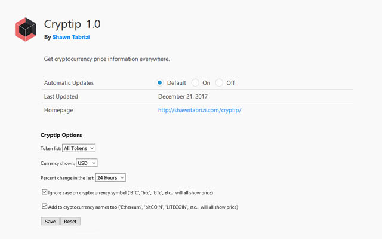

# Cryptip
## Get cryptocurrency price information everywhere.

Cryptip is a simple browser extension which adds cryptocurrency price information when you hover over cryptocurrency symbols. Try it out [here](http://shawntabrizi.com/cryptip/)!

Cryptip uses the CoinMarketCap API, which supports over 1000 different cryptocurrencies, and can show price information with respect to BTC or 31 different fiat currencies.

### Customization Options
Go into the Cryptip's extension menu to access `Cryptip Options`.

You will see the following configuration options:
* Token list: Adjust the number of tokens that Cryptip detects.

      [Top 10, 50, 100, 500, 1000, All Tokens]
    
* Currency shown: Adjust the output currency format.

      [USD, BTC, AUD, BRL, CAD, CHF, CLP, CNY, CZK, DKK, EUR, GBP, HKD, HUF, IDR, ILS, INR, JPY, KRW, MXN, MYR, NOK, NZD, PHP, PKR, PLN, RUB, SEK, SGD, THB, TRY, TWD, ZAR]
      
* Percent change in the last: Adjust the period of time represented by the percent change.
      
      [1 Hour, 24 Hours, 7 Days]
      
* Ignore case on cryptocurrency symbol: Adjust whether Cryptip will look for only capital symbols ('BTC') versus all casing ('btc', 'bTc', etc...).
     
      [true, false]
      
* Add to cryptocurrency names too: Adjust whether Cryptip detects cryptocurrency names too. Casing is automatically ignored. ('Bitcoin','bitcoin', 'biTCOin', etc...)

      [true, false]

### Found a bug? Have a suggestion? Want to say thanks?
I am always happy to receive any comments and criticisms about Cryptip. If you found an issue, or have an idea for ways to improve Cryptip, you can open an issue on GitHub or email me directly.

If you liked this product, you can say thanks by sending donations to:

ETH: `0xD62835Fe2B40C8411A10E7980a290270e6A23cDA`

BTC: `3QQJLmgMJdWDThvWpbvmrKH9WVJyBM9TZy`
